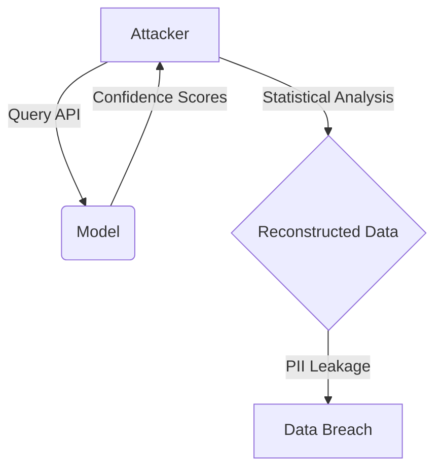

<Tldr title="Executive Summary">
As AI integration accelerates, traditional security boundaries are becoming increasingly porous. This research explores the three primary vectors of AI-driven architectural risk: model inversion, prompt injection, and data poisoning.
</Tldr>

## The Evolution of the Threat Landscape

In the past decade, security architecture focused on network perimeter defense. With the advent of Large Language Models (LLMs), the "perimeter" now exists within the application logic itself.

<Sidebar title="Key Metric" variant="note">
73% of security leaders expect AI-enhanced attacks to outpace traditional defensive capabilities by 2027.
</Sidebar>

### Architectural Vulnerabilities

The primary challenge lies in the non-deterministic nature of AI outputs. Unlike traditional software where `if-then` logic provides a predictable execution path, AI introduces a probabilistic layer that is difficult to audit.

<Disclosure title="Technical Deep-Dive: Model Inversion" defaultOpen={false}>
Model inversion attacks allow an adversary to reconstruct sensitive training data by querying the model's API. This is particularly dangerous in healthcare and financial sectors where training sets contain PII.

</Disclosure>

## Conclusion

Securing AI requires a shift from "verification at rest" to "continuous monitoring in flight." We must treat AI outputs as untrusted user input, regardless of the source.
