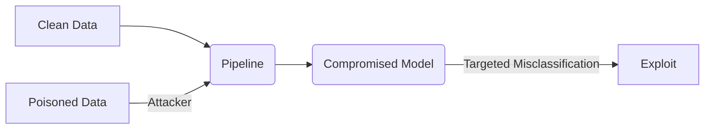

<Tldr title="Executive Summary">
The AI pipeline - from data collection to model deployment - is a complex chain of supply dependencies. Each stage introduces unique security risks that must be mitigated through a Zero-Trust framework.
</Tldr>

## The Supply Chain Problem

AI models are rarely built from scratch. They rely on pre-trained weights, open-source libraries, and third-party datasets. This "black box" supply chain is the new frontier for supply chain attacks.

<Sidebar title="Citations" variant="citation">
Smith et al. (2025) demonstrated that 45% of popular model repositories contained at least one dependency with a critical vulnerability.
</Sidebar>

### Pipeline Stages and Risks

1. **Data Ingestion**: Risk of data poisoning.
2. **Training**: Risk of backdoor insertion.
3. **Deployment**: Risk of inference-time attacks.

<Disclosure title="Threat Model: Pipeline Poisoning" defaultOpen={true}>
A visual representation of how an attacker can influence model behavior by injecting malicious samples into the training set.

</Disclosure>

## Implementation Strategy

To secure the pipeline, organizations must implement cryptographic signing for all training artifacts and perform behavioral analysis on model drift.
