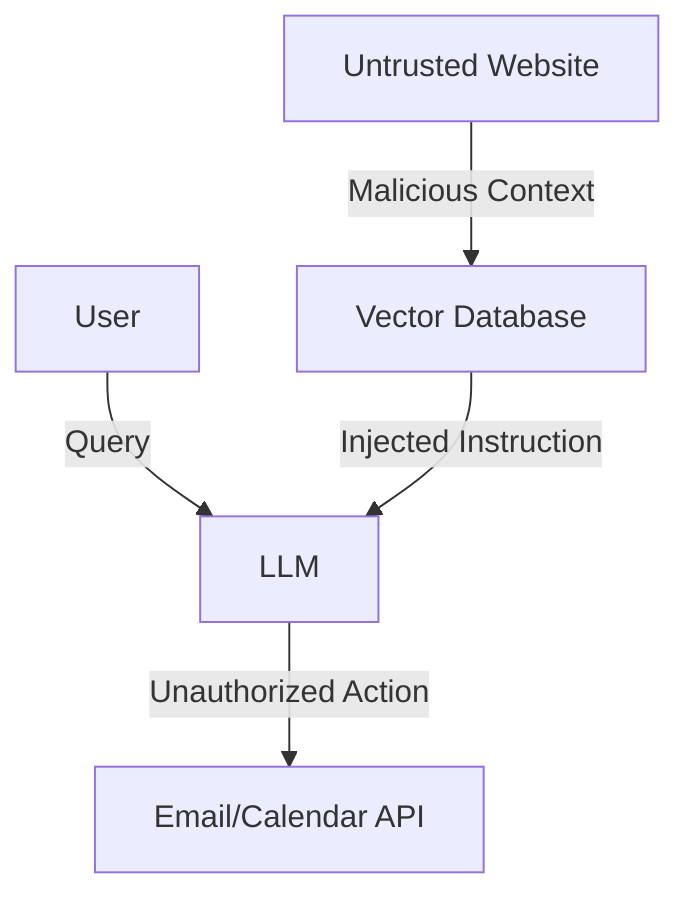

<Tldr title="Executive Summary">
Large Language Models (LLMs) are being integrated into enterprise workflows at an unprecedented rate. This post provides a standardized threat model for LLM integration, focusing on indirect prompt injection and data exfiltration.
</Tldr>

## The LLM Integration Stack

Integrating an LLM involves more than just an API call. It includes vector databases, RAG (Retrieval-Augmented Generation) systems, and agentic workflows.

<Sidebar title="Security Note" variant="info">
Indirect prompt injection occurs when an LLM processes untrusted data (like an email or web page) that contains hidden instructions.
</Sidebar>

### Visualizing the Attack Surface

The attack surface expands significantly when the LLM is given "agency" to perform actions via tools/plugins.

<Disclosure title="Mitigation: The Gateway Pattern" defaultOpen={false}>
The Gateway Pattern involves a dedicated security layer between the LLM and external systems, performing semantic analysis on both inputs and outputs.

1. **Input Sanitization**: Detecting prompt injection.
2. **Output Filtering**: Preventing PII leakage.
3. **Budgeting**: Preventing DoS via complex queries.
</Disclosure>

## Summary

Threat modeling for LLMs is not a one-time event but a continuous process of red-teaming and boundary definition.
